# 好芽儿用户流程图

> 本文档为 12 类角色分别设计**首次使用**和**日常使用**的流程。
> 系统账号分为 `ADMIN`（机构管理端）和 `PARENT`（家长端）两大类，员工岗位通过员工管理模块区分，不同岗位拥有对应的工作台和操作权限。

---

## 目录

1. [角色对比总览](#角色对比总览)
2. [2 岁宝宝的妈妈（未入园）](#1-2-岁宝宝的妈妈未入园)
3. [2 岁宝宝的爷爷（已入园）](#2-2-岁宝宝的爷爷已入园)
4. [机构负责人](#3-机构负责人)
5. [园长](#4-园长)
6. [教师](#5-教师)
7. [保育员](#6-保育员)
8. [财务](#7-财务)
9. [保健员/保健医](#8-保健员保健医)
10. [安全/后勤负责人](#9-安全后勤负责人)
11. [运营/招生](#10-运营招生)
12. [家长（已入园）](#11-家长已入园)
13. [平台/系统管理员](#12-平台系统管理员)

---

## 角色对比总览

| 角色 | 系统账号 / 员工岗位 | 主要页面 | 核心操作 |
|---|---|---|---|
| 妈妈（未入园） | PARENT | AI育儿、教育规划、成长记录 | 注册、浏览、咨询 |
| 爷爷（已入园） | PARENT / ELDER | 长辈模式、家长日报、家庭管理 | 查看日报、接送、委托 |
| 家长（已入园） | PARENT | 家长日报、家园协作、家庭管理 | 查看宝宝动态、家园沟通、缴费 |
| 平台/系统管理员 | ADMIN | 系统管理 | 系统配置、账号权限、全局运维 |
| 机构负责人 | ADMIN | 今日工作台、运营监管、园所运营 | 全局管控、监管导出 |
| 园长 | ADMIN / DIRECTOR | 园所运营、班级照护、日报管理、健康安全 | 日常运营管理 |
| 教师 | ADMIN / TEACHER | 今日工作台、班级照护 | 考勤、晨检、照护记录 |
| 保育员 | ADMIN / CAREGIVER | 班级照护 | 喂养、午睡、如厕记录 |
| 保健员/保健医 | ADMIN / HEALTH_WORKER、HEALTH_DOCTOR | 健康安全 | 晨检、用药、传染病、食谱台账 |
| 安全/后勤负责人 | ADMIN / SAFETY_OFFICER、LOGISTICS_STAFF | 健康安全→安全台账 | 设施巡检、消毒、隐患排查 |
| 财务 | ADMIN / FINANCE | 运营监管→收费 | 账单、收费管理 |
| 运营/招生 | ADMIN / OPERATIONS_STAFF、ADMISSIONS_OFFICER | 运营监管→招生 | 线索跟进、报名审核、试托转化 |

---

## 1. 2 岁宝宝的妈妈（未入园）

### 角色画像
- 宝宝 2 岁，尚未入托
- 正在考察托育机构
- 关心育儿知识和早期教育规划
- 需要通过平台了解机构、建立信任

### 首次使用流程图

```mermaid
flowchart TD
    A[开始] --> B[打开好芽儿登录页]
    B --> C{已有账号？}
    C -->|否| D[点击"注册"]
    C -->|是| E[输入账号密码登录]
    
    D --> F[填写注册信息\n用户名/密码/昵称]
    F --> G[同意用户协议]
    G --> H[注册成功]
    H --> E
    
    E --> I[首次进入系统\n角色：PARENT]
    I --> J[浏览系统功能]
    
    J --> K[查看「AI育儿」\n了解智能育儿助手]
    J --> L[查看「教育规划」\n浏览课程体系]
    J --> M[查看「成长记录」\n了解记录方式]
    J --> N[查看「家园协作」\n了解家校互动]
    
    K --> O[产生兴趣]
    L --> O
    M --> O
    N --> O
    
    O --> P{决定咨询？}
    P -->|是| Q[通过机构联系方式咨询\n或等待后续招生功能]
    P -->|否| R[继续浏览 / 退出]
    
    Q --> S[结束]
    R --> S
```

### 日常使用流程图

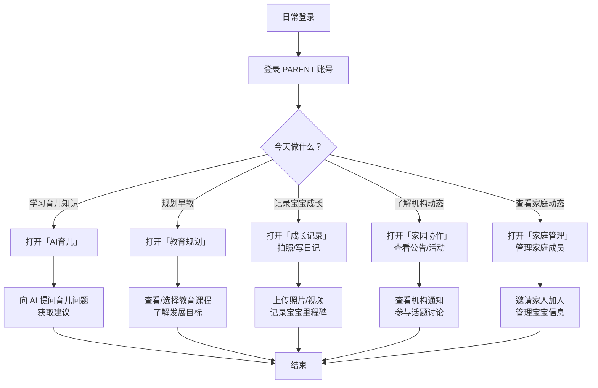

---

## 2. 2 岁宝宝的爷爷（已入园）

### 角色画像
- 宝宝已在托育机构
- 主要关注宝宝每日在园情况
- 可能需要负责接送
- 偏好简单大字界面（长辈模式）
- 不太熟悉智能手机操作

### 首次使用流程图

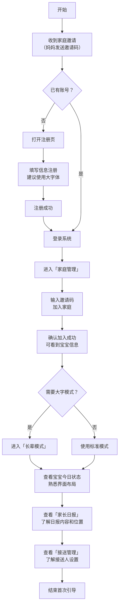

### 日常使用流程图

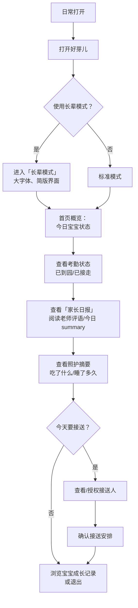

---

## 3. 机构负责人

### 角色画像
- 投资人或创办人
- 关注全局运营数据
- 不参与日常班级管理
- 需要监管报表和导出能力

### 首次使用流程图

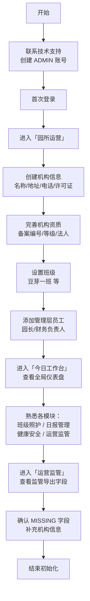

### 日常使用流程图

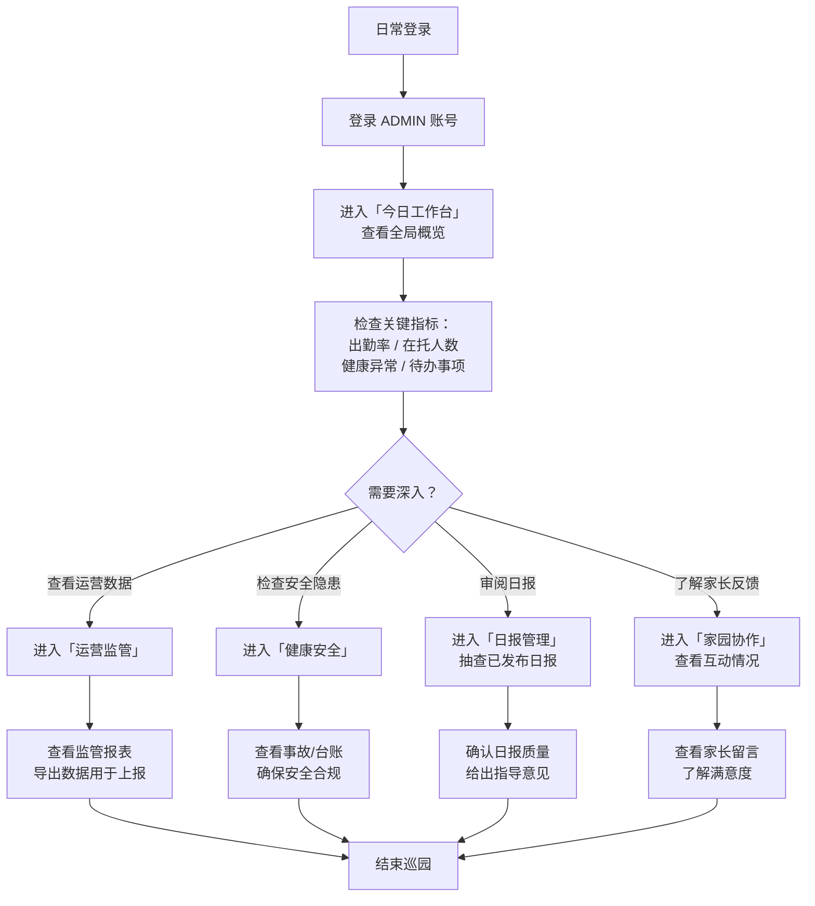

---

## 4. 园长

### 角色画像
- 机构日常运营管理者
- 管理教师团队和班级
- 审核日报、处理异常
- 规划教育课程和活动

### 首次使用流程图

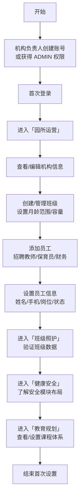

### 日常使用流程图

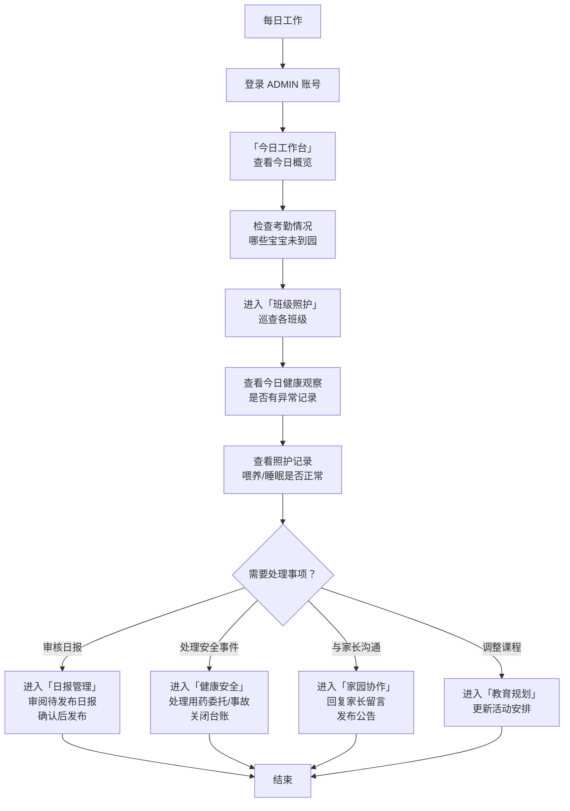

---

## 5. 教师

### 角色画像
- 直接带班的一线老师
- 负责晨检、照护记录、日报
- 与家长直接沟通
- 需要高效记录工具

### 首次使用流程图

```mermaid
flowchart TD
    A[开始] --> B[园长在员工管理中添加\n手机号/岗位=老师]
    B --> C[收到邀请/账号信息\n密码初始设置]
    C --> D[首次登录 ADMIN 账号]
    
    D --> E[进入「班级照护」\n查看分配班级]
    E --> F[查看今日幼儿列表\n熟悉系统界面]
    F --> G[进入「园所运营」\n查看班级和幼儿信息]
    G --> H[进入「今日工作台」\n了解工作台布局]
    
    H --> I[模拟操作：\n找到"小芽芽"的考勤/照护入口]
    I --> J[了解如何记录\n健康观察和照护记录]
    J --> K[了解日报生成流程\n知道草稿→编辑→发布]
    K --> L[结束培训]
```

### 日常使用流程图

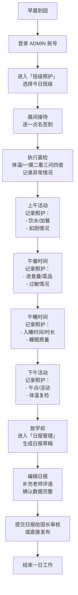

---

## 6. 保育员

### 角色画像
- 负责宝宝日常生活照料
- 关注喂养、睡眠、如厕、卫生
- 与教师配合工作
- 偏重记录而非管理

### 首次使用流程图

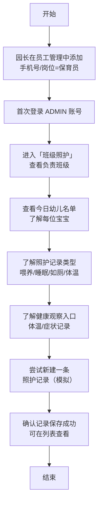

### 日常使用流程图

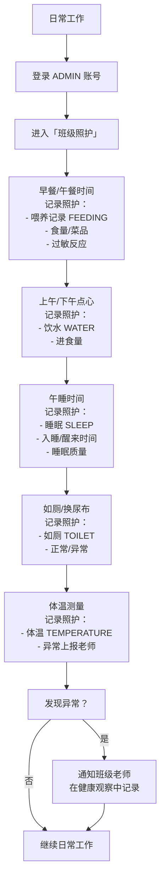

---

## 7. 财务

### 角色画像
- 负责收费管理
- 开具账单、记录缴费
- 跟踪欠费情况
- 需要财务统计报表

### 首次使用流程图

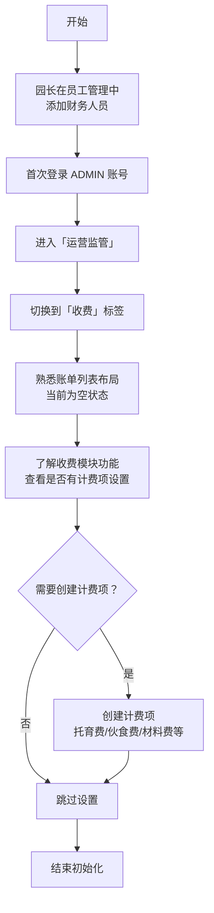

### 日常使用流程图

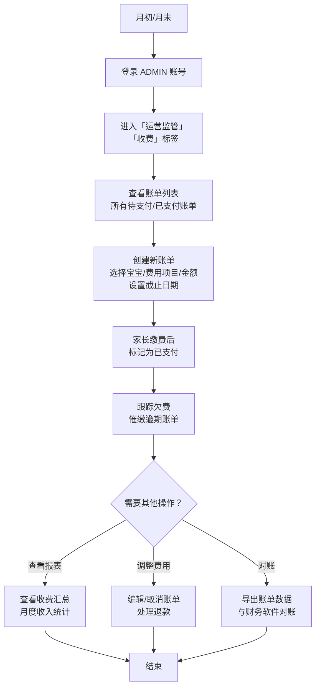

---


## 8. 保健员/保健医

### 角色画像
- 负责园区卫生保健、健康异常处理
- 管理用药委托、过敏、传染病防控
- 负责食谱、营养分析、食品留样
- 输出卫生保健台账和监管材料

### 首次使用流程图

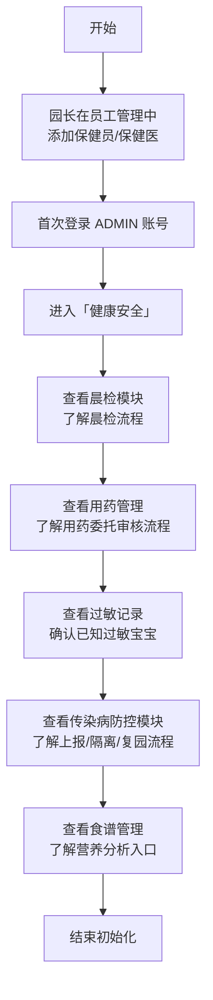

### 日常使用流程图

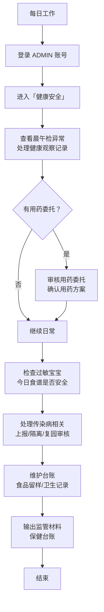

---

## 9. 安全/后勤负责人

### 角色画像
- 负责设施安全、消防、消毒、环境卫生
- 跟进隐患、事故、设施巡检
- 维护安全卫生台账

### 首次使用流程图

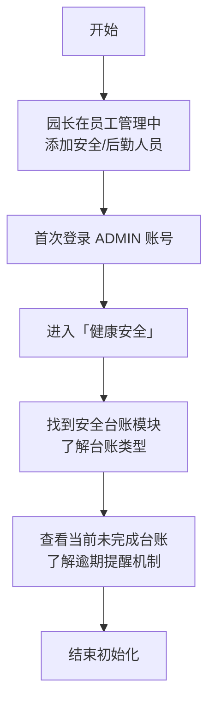

### 日常使用流程图

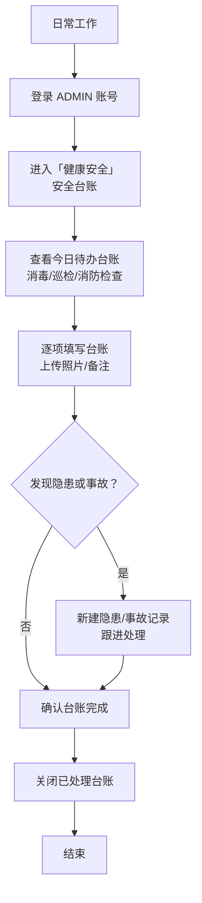

---

## 10. 运营/招生

### 角色画像
- 负责招生线索跟进、报名审核
- 管理试托、转入托流程
- 关注招生转化率和托位使用率

### 首次使用流程图

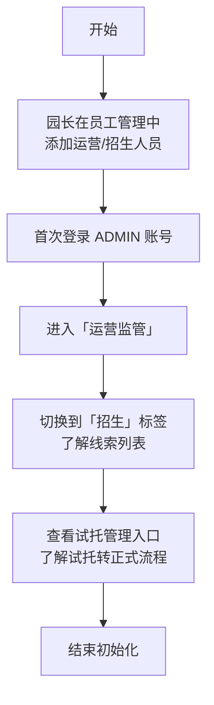

### 日常使用流程图

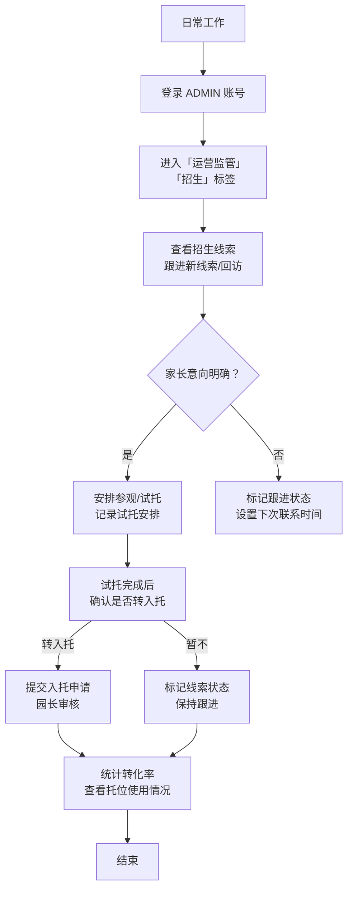

---

## 11. 家长（已入园）

### 角色画像
- 宝宝已在托育机构就读
- 关注宝宝每日在园情况
- 需要与园区进行家园沟通
- 管理接送人和缴费

### 首次使用流程图

```mermaid
flowchart TD
    A[开始] --> B[收到园区邀请码\n或自行注册]
    B --> C[登录 PARENT 账号]
    C --> D[输入邀请码\n绑定宝宝和入托档案]
    D --> E[确认宝宝信息\n核对入托资料]
    
    E --> F[浏览功能模块：\n家长日报 / 班级照护\n健康安全 / 缴费]
    F --> G[设置接送人\n添加备用接送人]
    G --> H[结束首次引导]
```

### 日常使用流程图

```mermaid
flowchart TD
    A[日常使用] --> B[登录 PARENT 账号]
    B --> C{今天关注什么？}
    
    C -->|查看宝宝状态| D[查看「家长日报」\n阅读今日照护摘要]
    C -->|健康相关| E[查看「健康安全」\n用药委托/晨检结果]
    C -->|家园沟通| F[进入「家园协作」\n查看通知/留言]
    C -->|缴费| G[查看「账单」\n缴费/查看欠费]
    C -->|接送管理| H[管理接送人\n委托接送]
    
    D --> I
    E --> I
    F --> I
    G --> I
    H --> I[结束]
```

---

## 12. 平台/系统管理员

### 角色画像
- 维护系统运行、账号、权限和基础配置
- 不参与具体园区日常业务
- 负责系统级别的问题处理

### 首次使用流程图

```mermaid
flowchart TD
    A[开始] --> B[获得平台管理员账号]
    B --> C[首次登录 ADMIN 账号]
    C --> D[进入「系统管理」]
    
    D --> E[配置系统基础参数\n品牌信息/数据字典]
    E --> F[配置角色权限\n菜单/按钮权限]
    F --> G[查看机构清单\n确认已入驻机构]
    
    G --> H[配置短信/文件/通知/登录策略]
    H --> I[查看审计日志\n了解系统运行状态]
    I --> J[结束初始化]
```

### 日常使用流程图

```mermaid
flowchart TD
    A[日常工作] --> B[登录 ADMIN 账号]
    B --> C[进入「系统管理」]
    
    C --> D{需要处理什么？}
    
    D -->|账号问题| E[管理平台账号\n创建/禁用/重置]
    D -->|权限调整| F[调整角色/菜单/按钮权限]
    D -->|系统配置| G[修改系统参数\n数据字典维护]
    D -->|异常处理| H[查看审计日志\n处理数据问题]
    D -->|机构查看| I[查看机构/园区状态\n了解使用情况]
    
    E --> J
    F --> J
    G --> J
    H --> J
    I --> J[结束]
```

---
## 附：角色与页面权限对照表

| 页面 | PARENT | ELDER | ADMIN-平台管理员 | ADMIN-园长 | ADMIN-机构负责人 | ADMIN-教师 | ADMIN-保育员 | ADMIN-保健员 | ADMIN-安全后勤 | ADMIN-财务 | ADMIN-运营招生 |
|---|---|---|---|---|---|---|---|---|---|---|---|
| 今日工作台 | ✅ | ✅ | ✅ | ✅ | ✅ | ✅ | ✅ | ✅ | ✅ | ✅ | ✅ |
| 成长记录 | ✅ | ❌ | ❌ | ❌ | ❌ | ❌ | ❌ | ❌ | ❌ | ❌ | ❌ |
| 园所运营 | ❌ | ❌ | ❌ | ✅ | ✅ | ✅ 只读 | ❌ | ❌ | ❌ | ❌ | ❌ |
| 班级照护 | ❌ | ❌ | ❌ | ✅ | ❌ | ✅ | ✅ | ❌ | ❌ | ❌ | ❌ |
| 日报管理 | ❌ | ❌ | ❌ | ✅ 审核 | ❌ | ✅ 编辑 | ❌ | ❌ | ❌ | ❌ | ❌ |
| 健康安全 | ❌ | ❌ | ❌ | ✅ | ❌ | ✅ 记录 | ✅ 记录 | ✅ | ✅ 台账 | ❌ | ❌ |
| 运营监管 | ❌ | ❌ | ❌ | ✅ | ✅ | ❌ | ❌ | ❌ | ❌ | ✅ 收费 | ✅ 招生 |
| AI 育儿 | ✅ | ❌ | ❌ | ❌ | ❌ | ❌ | ❌ | ❌ | ❌ | ❌ | ❌ |
| 教育规划 | ✅ | ❌ | ❌ | ✅ | ❌ | ❌ | ❌ | ❌ | ❌ | ❌ | ❌ |
| 家园协作 | ✅ | ✅ 阅读 | ❌ | ✅ | ❌ | ✅ 回复 | ❌ | ❌ | ❌ | ❌ | ❌ |
| 家长日报 | ✅ | ✅ 大字版 | ❌ | ✅ 审核 | ❌ | ✅ 编辑 | ❌ | ❌ | ❌ | ❌ | ❌ |
| 长辈模式 | ✅ | ✅ | ❌ | ❌ | ❌ | ❌ | ❌ | ❌ | ❌ | ❌ | ❌ |
| 家庭管理 | ✅ | ❌ | ❌ | ❌ | ❌ | ❌ | ❌ | ❌ | ❌ | ❌ | ❌ |
| 系统管理 | ❌ | ❌ | ✅ | ❌ | ❌ | ❌ | ❌ | ❌ | ❌ | ❌ | ❌ |
| 安全台账 | ❌ | ❌ | ❌ | ✅ | ❌ | ❌ | ❌ | ✅ | ✅ | ❌ | ❌ |
| 招生管理 | ❌ | ❌ | ❌ | ✅ | ✅ | ❌ | ❌ | ❌ | ❌ | ❌ | ✅ |
