# 好芽儿用户流程图

> 本文档为 7 类角色分别绘制**首次使用**和**日常使用**的流程。
> 系统当前账号体系：`ADMIN`（机构管理端）、`PARENT`（家长端），员工岗位通过员工管理模块区分。

---

## 目录

1. [角色对比总览](#角色对比总览)
2. [2 岁宝宝的妈妈（未入园）](#1-2-岁宝宝的妈妈未入园)
3. [2 岁宝宝的爷爷（已入园）](#2-2-岁宝宝的爷爷已入园)
4. [机构负责人](#3-机构负责人)
5. [园长](#4-园长)
6. [教师](#5-教师)
7. [保育员](#6-保育员)
8. [财务](#7-财务)

---

## 角色对比总览

| 角色 | 系统账号 | 主要页面 | 核心操作 |
|---|---|---|---|
| 妈妈（未入园） | PARENT | AI育儿、教育规划、成长记录 | 注册、浏览、咨询 |
| 爷爷（已入园） | PARENT | 长辈模式、家长日报、家庭管理 | 查看日报、接送、委托 |
| 机构负责人 | ADMIN | 今日工作台、运营监管、园所运营 | 全局管控、监管导出 |
| 园长 | ADMIN | 园所运营、班级照护、日报管理、健康安全 | 日常运营管理 |
| 教师 | ADMIN（员工：老师） | 今日工作台、班级照护 | 考勤、晨检、照护记录 |
| 保育员 | ADMIN（员工：保育员） | 班级照护 | 喂养、午睡、如厕记录 |
| 财务 | ADMIN（员工：财务） | 运营监管→收费 | 账单、收费管理 |

---

## 1. 2 岁宝宝的妈妈（未入园）

### 角色画像
- 宝宝 2 岁，尚未入托
- 正在考察托育机构
- 关心育儿知识和早期教育规划
- 需要通过平台了解机构、建立信任

### 首次使用流程图

```mermaid
flowchart TD
    A[开始] --> B[打开好芽儿登录页]
    B --> C{已有账号？}
    C -->|否| D[点击"注册"]
    C -->|是| E[输入账号密码登录]
    
    D --> F[填写注册信息\n用户名/密码/昵称]
    F --> G[同意用户协议]
    G --> H[注册成功]
    H --> E
    
    E --> I[首次进入系统\n角色：PARENT]
    I --> J[浏览系统功能]
    
    J --> K[查看「AI育儿」\n了解智能育儿助手]
    J --> L[查看「教育规划」\n浏览课程体系]
    J --> M[查看「成长记录」\n了解记录方式]
    J --> N[查看「家园协作」\n了解家校互动]
    
    K --> O[产生兴趣]
    L --> O
    M --> O
    N --> O
    
    O --> P{决定咨询？}
    P -->|是| Q[通过机构联系方式咨询\n或等待后续招生功能]
    P -->|否| R[继续浏览 / 退出]
    
    Q --> S[结束]
    R --> S
```

### 日常使用流程图

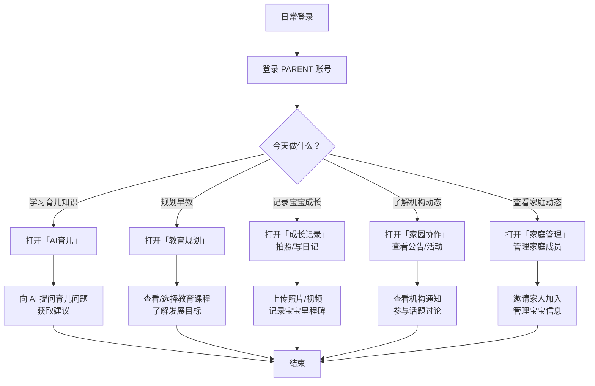

---

## 2. 2 岁宝宝的爷爷（已入园）

### 角色画像
- 宝宝已在托育机构
- 主要关注宝宝每日在园情况
- 可能需要负责接送
- 偏好简单大字界面（长辈模式）
- 不太熟悉智能手机操作

### 首次使用流程图

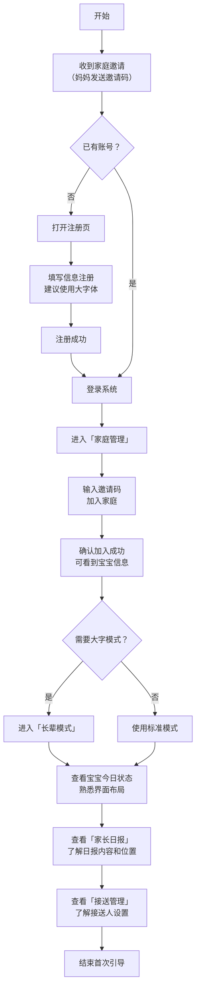

### 日常使用流程图

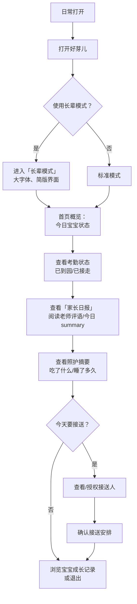

---

## 3. 机构负责人

### 角色画像
- 投资人或创办人
- 关注全局运营数据
- 不参与日常班级管理
- 需要监管报表和导出能力

### 首次使用流程图

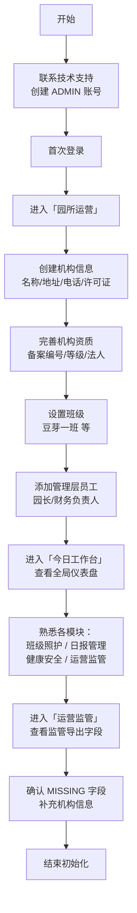

### 日常使用流程图

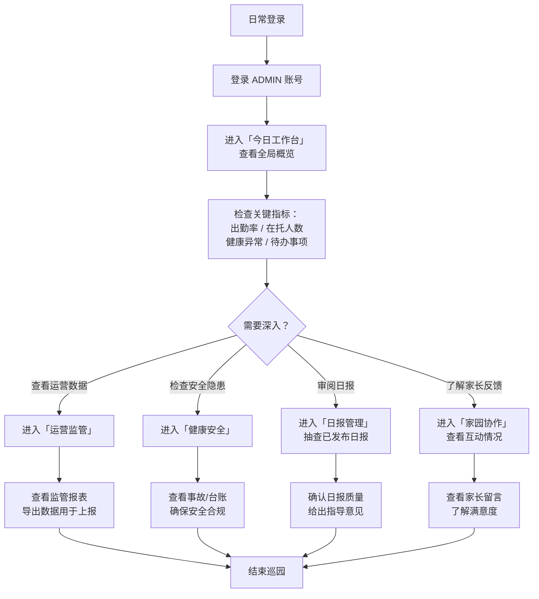

---

## 4. 园长

### 角色画像
- 机构日常运营管理者
- 管理教师团队和班级
- 审核日报、处理异常
- 规划教育课程和活动

### 首次使用流程图

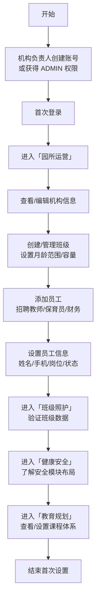

### 日常使用流程图

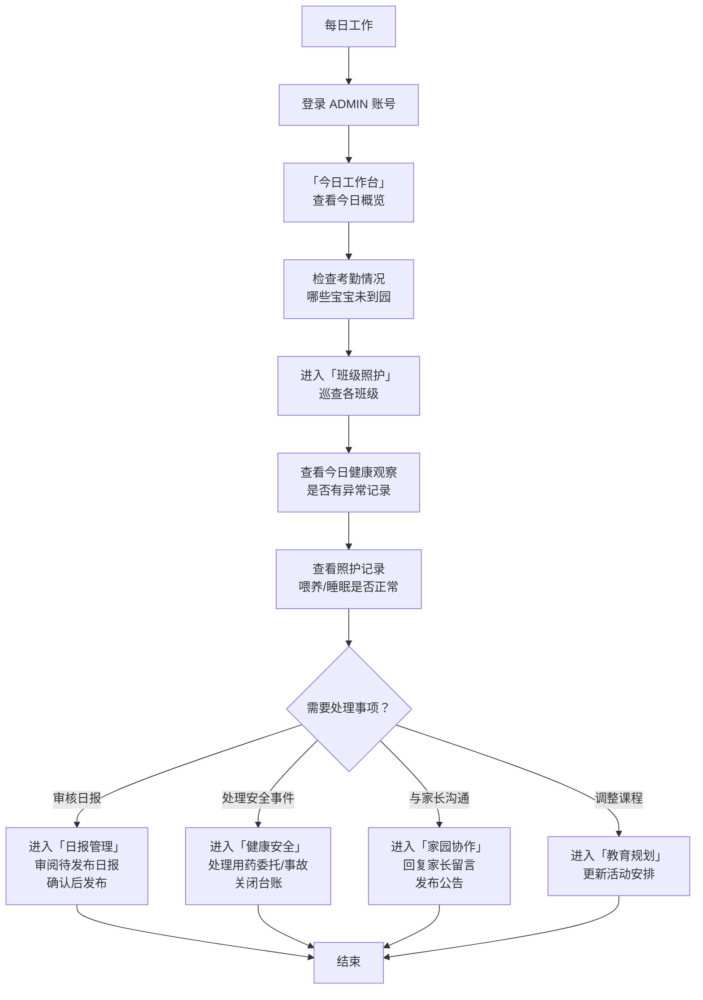

---

## 5. 教师

### 角色画像
- 直接带班的一线老师
- 负责晨检、照护记录、日报
- 与家长直接沟通
- 需要高效记录工具

### 首次使用流程图

```mermaid
flowchart TD
    A[开始] --> B[园长在员工管理中添加\n手机号/岗位=老师]
    B --> C[收到邀请/账号信息\n密码初始设置]
    C --> D[首次登录 ADMIN 账号]
    
    D --> E[进入「班级照护」\n查看分配班级]
    E --> F[查看今日幼儿列表\n熟悉系统界面]
    F --> G[进入「园所运营」\n查看班级和幼儿信息]
    G --> H[进入「今日工作台」\n了解工作台布局]
    
    H --> I[模拟操作：\n找到"小芽芽"的考勤/照护入口]
    I --> J[了解如何记录\n健康观察和照护记录]
    J --> K[了解日报生成流程\n知道草稿→编辑→发布]
    K --> L[结束培训]
```

### 日常使用流程图

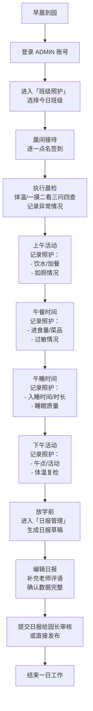

---

## 6. 保育员

### 角色画像
- 负责宝宝日常生活照料
- 关注喂养、睡眠、如厕、卫生
- 与教师配合工作
- 偏重记录而非管理

### 首次使用流程图

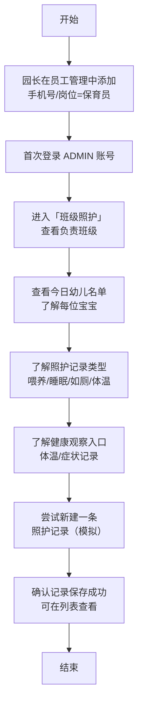

### 日常使用流程图

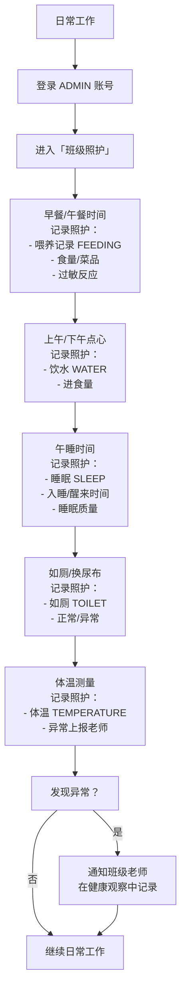

---

## 7. 财务

### 角色画像
- 负责收费管理
- 开具账单、记录缴费
- 跟踪欠费情况
- 需要财务统计报表

### 首次使用流程图

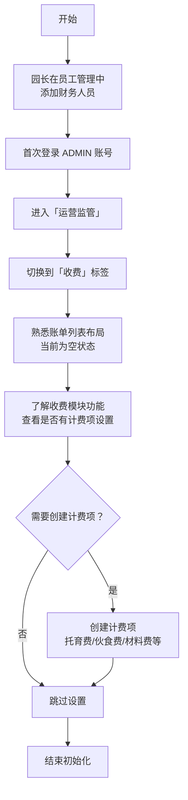

### 日常使用流程图

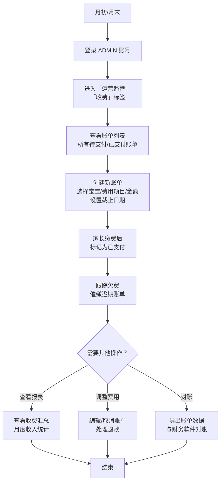

---

## 附：角色与页面权限对照表

| 页面 | PARENT | ADMIN-园长 | ADMIN-教师 | ADMIN-保育员 | ADMIN-财务 |
|---|---|---|---|---|---|
| 今日工作台 | ✅ | ✅ | ✅ | ✅ | ✅ |
| 成长记录 | ✅ | ❌ | ❌ | ❌ | ❌ |
| 园所运营 | ❌ | ✅ | ✅（只读？） | ❌ | ❌ |
| 班级照护 | ❌ | ✅ | ✅ | ✅ | ❌ |
| 日报管理 | ❌ | ✅ | ✅ | ❌ | ❌ |
| 健康安全 | ❌ | ✅ | ✅（记录） | ✅（记录） | ❌ |
| 运营监管 | ❌ | ✅ | ❌ | ❌ | ✅（收费） |
| AI 育儿 | ✅ | ❌ | ❌ | ❌ | ❌ |
| 教育规划 | ✅ | ✅ | ❌ | ❌ | ❌ |
| 家园协作 | ✅ | ✅ | ✅（回复） | ❌ | ❌ |
| 家长日报 | ✅ | ✅（审核） | ✅（编辑） | ❌ | ❌ |
| 长辈模式 | ✅ | ❌ | ❌ | ❌ | ❌ |
| 家庭管理 | ✅ | ❌ | ❌ | ❌ | ❌ |

> 注：系统目前角色权限粒度为 ADMIN/PARENT 两级，上表中"只读/记录/编辑/审核"等为模拟的岗位职责划分，实际权限控制需要后续细化。
